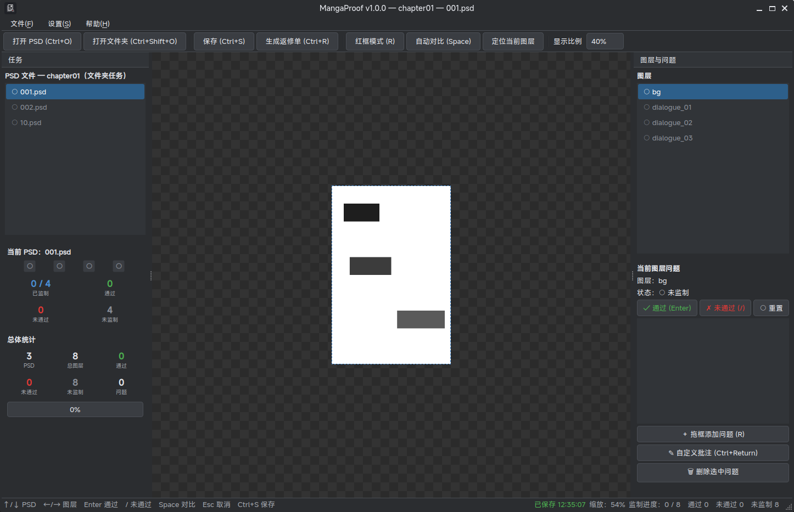
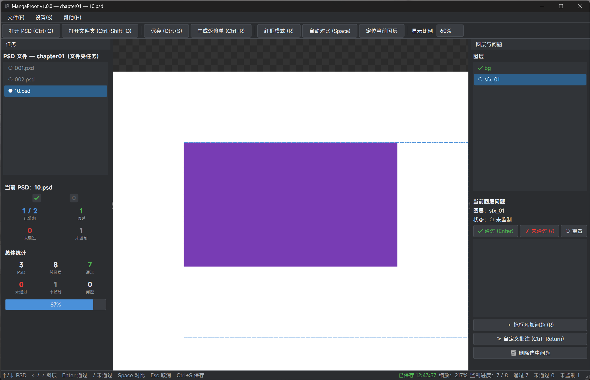

# MangaProof v1.0

**漫画翻译 · 嵌字 · 修图 的高速监制工作台** —— 面向漫画翻译后期 QA 的独立桌面工具，
把「逐页逐层检查翻译嵌字质量」从反复的鼠标操作中解放出来。

## 为什么为嵌字监制而做

翻译/嵌字完成后的监制（QA）环节，传统做法是在 Photoshop 里逐层翻看：切图层、缩放、
看原图、找问题、记位置、写批注——每一步都在重复点击。MangaProof 把整条链路变成
**键盘驱动的流水线**：

```
打开文件夹 → 自动恢复上次进度 → 图层自动对准视口中心
→ Space 闪切原图/背景 → Enter 通过 / "/" 标记问题
→ 拖框圈出问题位置 + 快捷键选问题类型 + 批注
→ 自动跳到下一个未监制 → 全部完成 → 一键生成返修单 PDF 交给嵌字/修图
```

## 特色功能（围绕嵌字监制场景）

### 1. 键盘驱动的高速监制

| 操作 | 按键 | 说明 |
|---|---|---|
| 上一个 / 下一个 PSD | `↑` / `↓` | 粗粒度翻页 |
| 上一个 / 下一个图层 | `←` / `→` | 细粒度逐层检查 |
| 当前图层通过 | `Enter` | 自动跳到**下一个未监制图层**（不按索引死走） |
| 当前图层未通过 | `/` | 标记问题，可继续拖红框、加批注，完成后 Enter 继续 |
| 自动对比 | `Space` | Original ↔ 背景 闪切（自动挡）/ 按一下切一次（手动挡） |

所有按钮上都显示当前绑定的快捷键，可在设置 →「设置快捷键…」独立窗口中重绑定，改完立即同步到界面。

### 2. Original ↔ 背景闪切（检查嵌字与背景分离）

嵌字质量最常见的问题就是「字没抠干净」「背景透出来了」。按 `Space` 启动自动对比：

- 默认每秒切换 4 次（每状态 250ms），字和背景的分界在闪切中一目了然；速度可在
  设置中调整，五档预设——慢 / 较慢 / 正常 / 较快 / 快 = 1 / 2 / 4 / 5 / 8 次/秒
  （每张停留 1000 / 500 / 250 / 200 / 125ms），对比运行中调整即时生效；
- 设置中可切换为**手动挡**：按一下 `Space`（或点击工具栏按钮）切换一次，
  适合逐帧细看；按 `Esc` 或做其他操作（切文件/图层、通过/不通过、批注等）
  会自动回到原图；
- 对比期间 Camera、缩放、当前图层、红框 Overlay 全部保持不动，只切显示源；
- 背景图层自动选择：优先严格名为 `bg` 的图层，否则取最底部有像素内容的图层；
- 对比中禁止创建问题（先 Space 停止再标注），红框始终可见。

### 3. 自动对准：视觉中心 + 可调显示比例

选择图层后自动做两件事（类 Photoshop 的智能定位）：

- **视觉中心定位**：按 `alpha > 0` 的像素计算实际内容包围盒，把图层内容的视觉中心
  对准视口中心——而不是盲取图层 Bounds 的几何中心；
- **按比例缩放**：20%～90% 可选（默认 60%），最长边占视口对应尺寸的比例；
- 手动 Pan/Zoom（滚轮上下平移、Ctrl+滚轮缩放、Alt+滚轮左右平移、拖拽平移；
  裸滚轮行为可在设置中切换为缩放，触控板双指滚恒为平移）不会被自动恢复，
  只有切换图层/显式重定位才触发。

### 4. 大 PSD 无感切换（两阶段预加载）

50MB、几百图层的 PSD 翻页不再卡：

- **后台预加载线程**：打开任务后自动预热当前文件邻域（后 3 个 + 前 1 个）；
- **两阶段流水线**，状态栏独立显示：
  - 「**图像预加载**」：先铺开各文件的 merged image（切换关键路径）；
  - 「**图层预热**」：再补背景图与全部图层的视觉边界；
- 已预热 → 切换秒开；未命中 → 异步加载 + 非模态进度框，可继续快速连按切换；
- 窗口外文档的大图自动回收内存（图层树与层像素 LRU 保留），回退查看自动重载；
- merged 解码走 Pillow 原生 C 路径（约 7×），ZIP 预测压缩走自研 C 加速
  （约 200×），RLE 由 psd-tools 官方 Cython 扩展覆盖；
- 「图层预热」的视觉边界对平坦图层走 **alpha 直取快路径**：直接解码图层
  alpha 通道算包围盒，跳过 composite 合成管线 / ICC 色彩转换 / RGBA 转换
  （实测大图层 1.05s → 0.03s，约 38×）；有蒙版、特效或剪贴关系的图层
  自动回退完整合成，保证边界正确；
- 图层像素每层只提取一次：预热流程「提取一次 → 复用算边界」，背景图层的
  探测与提取共享 LRU 缓存，不再重复解码（此前每层 2 次、背景层 3 次）。

### 5. 问题标注体系：红框 + 类型 + 批注 + 编号

失败图层支持多问题标注：

- **红框**（粗红镂空、中间透明、不遮原画面），坐标以 **PSD 世界坐标**保存——
  缩放/平移/窗口变化后依然精确跟随原图；
- **19 类预制问题**：居中错误、字体选择错误、字体字重错误、字号错误、文字位置错误、
  文字间距错误、气泡处理错误、原文字擦除错误、背景擦除错误、网点对齐错误、
  网点残留、修图瑕疵、漏翻、漏字、错字、翻译错误、排版错误、文字溢出、其他；
- 每类问题有**快捷键**（默认 `1`~`9`、`0`、`Q`~`O`，可在设置中重绑定）；
- 两种创建方式：先按快捷键选类型再拖框；或先拖框再选类型（`R` 红框模式）；
- **自定义批注**（`Ctrl+Enter`）直接输入自由文本，如
  「这里应使用 Bold，而不是 Regular」；
- 问题编号与红框徽标一一对应，一份图层可有多个问题（居中错误 + 漏字 + …）。

### 6. 断点恢复：身份验证 + 自动保存

- 打开文件夹自动寻找 `.mangaproof.json`（单 PSD 为同目录同名文件），验证通过
  即恢复上次位置、状态、红框与批注——无需手动加载；
- **身份验证**（绝不做 PSD 深度解析）：单文件用完整 SHA-256；文件夹用 2～3 个
  分散抽样 Hash + 其余文件大小校验，验证失败一律禁止恢复；
- 操作后自动保存（防抖），`Ctrl+S` 立即保存，底栏显示「已保存 / 未保存」；
- 重新绑定已移动的文件夹时会先做**醒目强提醒**，验证失败绝不自动恢复。

### 7. MangaProof 返修单（PDF）

监制完成的产物是**交给嵌字/修图人员执行修改的返修任务单**，不是统计报告：

- 封面：任务名、生成时间、PSD 数、总图层、通过/未通过/未监制；未完成时明确标注
  「任务状态：未完成」；
- PSD 总览表：每页的进度与问题数；
- 问题明细页：**页面图像 + PDF 矢量红框 + ①②③ 编号 + 批注**（红框由 PDF 矢量
  矩形绘制，不截图 GUI）；
- 自动命名兼容嵌字脚本固定路径：所在文件夹为 `output` 时默认取上一级文件夹名；
- 未全部完成时也允许生成，返修单会如实标注未完成。

### 8. 监制统计：一眼看清进度

- 当前 PSD：图层状态芯片墙（○/✓/✗，**可点击直接跳转**）+ 2×2 统计卡片；
- 总体：PSD 数、总图层、通过/未通过/未监制卡片 + 进度条；
- 通过绿、未通过红、未监制灰、问题数警示橙，语义色贯穿全界面。

## 核心原则（四条技术边界）

- **独立于 Photoshop**：不调用任何 Photoshop API（UXP/JSX/CEP），视图控制全部自研；
- **PSD 只读**：绝不修改原始 PSD（图层、可见性、红框、批注一律不写入）；
- **不重新合成 PSD**：Original 直接使用 PSD 自带 merged/composite image，
  程序不实现 Photoshop Renderer（无 merged image 时明确报错，不做 fallback）；
- **监制数据与 PSD 隔离**：状态、问题、红框、批注、进度全部存在任务文件中。

## 快速开始

```bash
# uv 管理的项目虚拟环境，不污染系统 Python
uv sync

# 启动（程序目录 = 本文件所在目录，settings.json 落在这里）
uv run main.py
```

打开单个 PSD 或整个漫画文件夹即可开始；历史任务自动恢复。

> **性能提示**：直接运行源码时，个别热点解码函数（ZIP 预测压缩的 PSD 通道
> 解码等）会退化为 psd-tools 的纯 Python 实现，预加载/提取速度会明显下降。
> 若想体验完整加速，按优先级推荐：
>
> 1. **直接使用构建产物**（GitHub Actions 工件或 Release 安装包，见「CI 自动打包」）；
> 2. **从构建产物中提取编译好的 C 扩展**：把 `_internal/mangaproof/_psd_fast.so`
>    （Windows 为 `_psd_fast.pyd`）复制到本项目 `mangaproof/` 目录下即可生效；
> 3. **本地自行编译**：`uv run python scripts/build_accel.py`
>    （需 gcc / clang / MSVC；macOS / Linux 可直接编译，Windows 需 Visual Studio
>    C++ 工具链）。

## 界面截图（建议补充的实拍）

> 截图放在 `README.assets/`，下表为推荐捕获的界面与时机；已放入的
> `screenshot-1.png` / `screenshot-2.png` 可按下表说明替换/更新。





| 编号 | 场景 | 建议内容 |
|---|---|---|
| screenshot-1 | 主界面总览 | 打开一个漫画文件夹后的完整界面：左 PSD 列表、中画布、右图层/问题面板、底栏状态 |
| screenshot-2 | 图层定位 | 当前对话框图层被自动对准视口中心 + 蓝色虚线框标出图层内容轮廓 |
| screenshot-3 | 闪切对比 | 同一画面两张：Original（merged）与 BG-only（背景），说明 Space 闪切的对象 |
| screenshot-4 | 问题标注 | 失败图层上的红色问题框 + 编号徽标，右侧问题面板显示类型与批注 |
| screenshot-5 | 统计面板 | 当前 PSD 图层芯片墙（○✓✗）+ 总体统计卡片与进度条 |
| screenshot-6 | 状态栏 | 「图像预加载完成 ｜ 图层预热完成 ｜ 缩放 ｜ 已保存」 |
| screenshot-7 | 设置对话框 | 显示比例 / 自动对比模式与速度 / 控制台开关；快捷键经「设置快捷键…」独立窗口重绑定 |
| screenshot-8 | 返修单 PDF | 问题明细页：页面图像 + 矢量红框 + ①②③ 编号 + 批注 |
| screenshot-9 | 任务恢复提醒 | 「⚠ 重要提醒」重新绑定对话框（或验证失败警告） |
| screenshot-10 | 快捷键设置子对话框 | 核心快捷键 + 问题类型快捷键 + 自定义批注键的独立重绑定窗口（含恢复默认） |

## 快捷键（均可在 设置 →「设置快捷键…」独立窗口中重绑定）

| 功能 | 默认 |
|---|---|
| 上一个 / 下一个 PSD | `↑` / `↓` |
| 上一个 / 下一个图层 | `←` / `→` |
| 当前图层通过 | `Enter` |
| 当前图层未通过 | `/` |
| 自动对比 | `Space`（自动挡开/关；手动挡按一下切一次） |
| 取消批注 / 停止对比 | `Esc` |
| 保存任务 | `Ctrl+S` |
| 红框模式 | `R` |
| 自定义批注 | `Ctrl+Enter` |
| 问题类型 | `1`~`9`、`0`、`Q`~`O`（预制 19 类，可配置） |
| 打开 PSD / 文件夹 | `Ctrl+O` / `Ctrl+Shift+O` |
| 生成返修单 | `Ctrl+R` |

## 数据文件（三层隔离）

```
程序级设置   程序目录/settings.json          （显示比例、对比模式与速度、快捷键、PDF 开关、内存策略…）
任务级数据   漫画目录/.mangaproof.json       （文件夹任务）
            或 001.mangaproof.json          （单 PSD 任务，同目录同名）
缓存        独立内存 LRU（非任务恢复必需）
```

任务匹配验证：单 PSD = 完整 SHA-256；文件夹 = 2～3 个分散抽样 Hash + 其余
文件大小校验；失败一律禁止恢复，不提供强制恢复。

## 性能

- 两阶段后台预加载（图像预加载 + 图层预热），顺序监制文件/图层切换均无感；
- merged 提取走 **Pillow 原生 C 解码**（约 7×，失败自动回退 psd-tools）；
- ZIP 预测压缩解码走**自研纯 C 加速**（`scripts/build_accel.py` 编译，ctypes
  运行时补丁进 psd-tools，实测约 200×）；RLE 由 psd-tools 官方 Cython 扩展覆盖；
- 视觉边界（图层预热）走 **alpha 直取快路径**：平坦图层仅解码 alpha 通道，
  跳过 composite 合成 / ICC 色彩转换 / RGBA 转换（约 38×），蒙版/特效/剪贴
  图层自动回退完整合成保证正确性；图层像素每层只提取一次，背景层不再重复解码；
- 实测（15 页大 PSD）：图层预热 39.0s → 4.7s（约 8.3×），典型单页约
  2.8s → 0.3s（约 10×）；4 页邻域两阶段预加载合计 1 秒内完成，未命中预加载
  的切换加载窗一闪而过；
- 未命中预加载的切换走异步加载 + 非模态进度框；快速连续切换自动替换过期请求；
- 窗口外文档大图自动回收，内存有界；
- **内存回收策略三档**（设置中热切换，无需重启）：
  - 文档结构按窗口驱逐（三档一致）：仅当前页 + 邻域保留完整文档对象，
    窗口外惰性重建（重开 ~0.2s），内存与书本页数无关；
  - 宽松 / 平衡 / 激进 = LRU 768 / 512 / 256MB，bg 预生成池 768 / 512MB /
    仅 2 张；当前页背景图钉住，不被淘汰。

## 打包（PyInstaller onedir / .app）

```bash
# Windows → dist/MangaProof/     macOS → dist/MangaProof.app      Linux → dist/MangaProof/
uv run pyinstaller --clean --noconfirm packaging/main_win.spec
uv run pyinstaller --clean --noconfirm packaging/main_macos.spec
uv run pyinstaller --clean --noconfirm packaging/main_linux.spec
```

- 图标：Windows `ico/ico.ico`、macOS `ico/ico.icns`、Linux 运行时窗口图标来自
  `ico/ico.png`（桌面图标见 `packaging/linux/mangaproof.desktop`）；
- 控制台行为：直接运行 `python main.py` 始终保留控制台；Windows 打包默认
  FreeConsole 关闭窗口（设置可随时 AllocConsole 恢复）；macOS/Linux 无独立
  控制台窗口，由 `console=False` 决定。

## CI 自动打包

`.github/workflows/build.yml`：推送 `master` 构建并上传工件、推送 `v*` 标签自动
创建 GitHub Release、可手动触发。构建 5 个主流平台组合（Windows x64 / Linux
x64+arm64 / macOS Intel+Apple Silicon），每平台先做离屏启动冒烟测试再上传；
Windows 的加速扩展由 Linux 跑者 mingw 交叉编译，不依赖 MSVC 环境。

## 图标 / 字体

- 图标：`ico/ico.png`（运行时）、`ico/ico.icns`（macOS，`scripts/make_icns.py` 生成）、
  `ico/ico.ico`（Windows）；
- 字体：统一使用小米 **MiSans**（`font/MiSans-Medium.ttf`），直接运行与打包路径
  自动识别；依据《MiSans 字体知识产权许可协议》使用（「关于」与 README 注明、
  不改编、不单独分发），缺失时回退系统字体。

## 第三方许可

帮助 → 关于（产品信息）与帮助 → 第三方许可（组件声明）分离。第三方许可页覆盖
Python、psd-tools、NumPy、PySide6/Qt、reportlab、Pillow、PyInstaller、altgraph、
MiSans 字体，逐项列出名称、版本、SPDX 许可证标识、版权、主页与许可证全文/官方链接
（版本号运行时从包元数据解析）。

## 项目结构

```
mangaproof/
├── main.py            # 入口
├── ui/                # 主窗口、Viewer、面板、设置/许可对话框、预加载线程
├── psd/               # PSD 加载、文档模型、LRU 图像缓存
├── camera/            # Camera、视觉中心、自动缩放
├── review/            # 监制状态、问题、导航、持久化 + 哈希验证
├── compare/           # 自动对比控制器（速度可配置，支持自动/手动挡）
├── report/            # MangaProof 返修单 PDF（纯 Python）
├── config/            # settings.json 与统一程序路径服务
├── utils/             # 自然排序、日志
├── console.py         # 打包产物控制台可见性控制
├── fonts.py           # 统一字体加载
├── psd_accel.py       # psd-tools 解码加速运行时补丁
└── _psd_fast.c        # 纯 C 解码加速（scripts/build_accel.py 编译）
packaging/             # 三平台 PyInstaller spec 与 Linux 桌面模板
scripts/               # 构建/加速扩展/图标生成脚本
tests/                 # 测试夹具生成与冒烟测试
```
